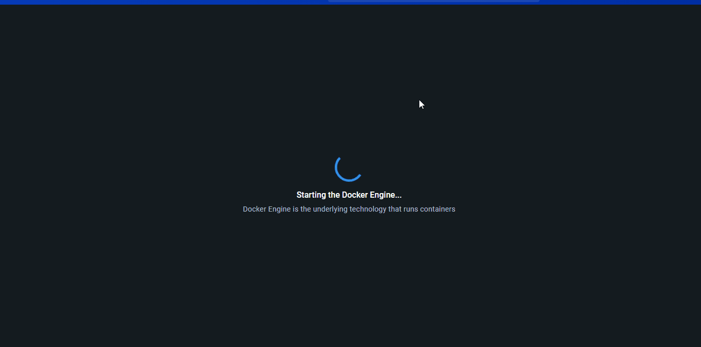

# :receipt: Introdução

O objetivo deste repositório e demonstrar como `instalar o Docker desktop para Windowns`, como `instalar o WSL 2` da melhor forma, alguns comandos básicos e como deixar o visual mais bonito.
> E outra coisa bem importante que percebi em diversos tutoriais, é que falta demosntrar para o desenvolvedor iniciante como funciona desenvolver neste anbiente. 

- E aqui quero mostrar como `criar um projeto laravel` da melhor forma como abrir seu `projeto no PHPSTORM` e agluns `comandos basicos usando SAIL`.


## :pushpin: Documentação WSL 2

:speech_balloon: Documentação da Microsoft sobre WSL:

> [:books: `Subsistema Windows para Linux`](https://learn.microsoft.com/pt-br/windows/wsl/)


### :zap: Instalando WSL 2

> Importante seu sistema estar atualizado. Caso não esteja vai em `configurações` e `atualização e segurança`.

Abra o Power Shell como administrador para fazer este processo.

```
    # Instalação do WSL
    wsl --install
    
    # Caso ocorra algum problema, você pode usar o comando
    wsl --install -d Ubuntu
    
    # Versão - importante fechar e abrir novamente o power shell
    wsl -l -v
```

Agora você pode ir no botão iniciar do Windowns e abrir o terminal do Ubunto e atualizar o Linux.
```
    # update
    sudo apt update
    
    # install Vim - Editor de texto
    sudo apt install vim
```


### :zap: Download Docker Desktop on Windowns

> [:books: `Docker Engine`](https://docs.docker.com/engine/install/)

Instalar o Docker é bem facil e enquanto o sistema é instalado, `recomendamos` você criar uma conta no site do [Docker hub](https://hub.docker.com)
Essa conta é necessária para depois quando você for abrir o docker.

Abaixo o docker e configurações básicas.

<p align="center">
	
</p>

### :zap: ZSH e PowerLevel10k

```
    # Antes instale o Curl
    sudo apt install curl
```

> :zap: Configuração do Zsh + Powerlevel 10k seguir conforme documentação do link [`Setup Zsh + Oh my Zsh + Powerlevel10k`](https://medium.com/@satriajanaka09/setup-zsh-oh-my-zsh-powerlevel10k-on-ubuntu-20-04-c4a4052508fd)

```Dicas
    # para usar o vim - editor
    vim ~/.zshrc
    
    # caso não tenha permissão
    sudo vim~/.zshrc
    
    #sair do editor: ESC + :wq + enter
```

Caso fique bugado e sem as fontes no passo 7 da documentação, siga o doc [Installing Powerline fonts on Windows 10](https://gist.github.com/stramel/658d702f3af8a86a6fe8b588720e0e23)

- Antes do passo 7 faça:
```
    sudo apt install jq
    
    # important: Aqui gerou erro - se alguém souber [parse error: Invalid numeric literal at line 1, column 10]
    curl https://api.punkapi.com/v2/beers | jq
``` 


### :zap: Adicionais documentações de configurações
[`Digital Ocean` - Como instalar e configurar o Laravel com o Docker Compose no Ubuntu 20.04](https://www.digitalocean.com/community/tutorials/how-to-install-and-set-up-laravel-with-docker-compose-on-ubuntu-20-04-pt)

<br>

## :zap: Criar projeto laravel | Docker Installation Using Sail
[Doc laravel com SAIL | create project](https://laravel.com/docs/11.x#docker-installation-using-sail)

```create project laravel
    curl -s "https://laravel.build/example-app?with=mysql,redis,mailpit" | bash
```

Os comandos no terminal do PHPSTORM serão utilizados agora o `./vendor/bin/sail`

```Comandos
    ./vendor/bin/sail artisan migrate
```


<br>

### Contatos

Contatos 👇🏼 [rafaelblum_digital@hotmail.com]

[](https://www.youtube.com/channel/UCMvtn8HZ12Ud-sdkY5KzTog)
[](https://www.instagram.com/rafablum_/)
[](https://twitter.com/universoCode)
[](https://www.linkedin.com/in/rafael-blum-237133114/)
[](https://github.com/RafaelBlum)

<br/>

 <em><b>Adoro me conectar com pessoas diferentes,</b> então se você quiser dizer <b>oi, ficarei feliz em conhecê-lo mais!</b> :)</em>
